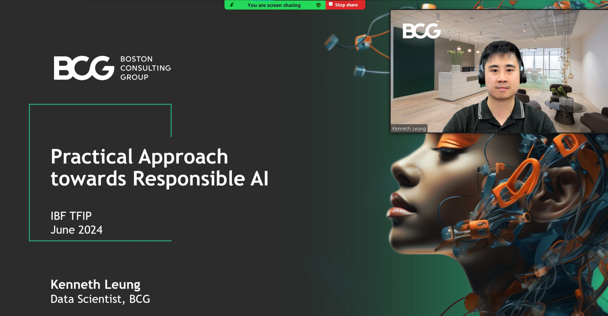

# Responsible AI Masterclass

## Overview
- Many resources on responsible AI (RAI) are too theoretical and full of text, making them hard to engage with and understand for practitioners.
- In the Responsible AI masterclass I develop and deliver for the Institute of Banking & Finance Singapore (IBFSG) Technology in Finance Immersion Programme, I focus on practical, interactive learning tailored to the financial services industry.
- This repository contains links to the Colab notebooks and the agenda I used in my masterclass.

- In the masterclass, I cover three open-source libraries, each focusing on a different aspect of AI: diagnosing fairness and transparency, correcting biases, and adding safety features to large language models (LLMs):
    1. **Veritas** (created by the Monetary Authority of Singapore and industry partners) evaluates fairness and transparency in machine learning models.
    2. **AI Fairness 360** (by IBM) helps detect and reduce biases in AI applications.
    3. **NeMo Guardrails** (by NVIDIA) provides safety features for AI-based conversational systems.

> *Note: Due to restrictions, I can’t share the full presentation. However, the class agenda below should help you build your own Responsible AI lessons.*

___
## Colab Notebooks
- **Veritas toolkit**: https://colab.research.google.com/drive/1cLkmQpWSJMZBxZ8tQrhcQqtCghOvD3bI
- **NeMo Guardrails**: https://colab.research.google.com/drive/1a5ysrAJPSfAszPAkJPTzqP0ZYlDFo8Zb

> Feel free to DM me if you are interested in the AIF360 notebook as well

___
## Masterclass Agenda
Here is the structured agenda for the RAI masterclass

#### 1. Introduction to Responsible AI (5 mins)
- Briefly outline the importance and objectives of implementing AI responsibly. Discuss how responsible AI ensures fairness, accountability, transparency, and ethical use of AI technologies.
- Include real-world examples of high profile failed ML projects (adapted from https://github.com/kennethleungty/Failed-ML)

#### 2. Fairness, Ethics, Accountability & Transparency (10 mins)
- Introduce the FEAT (Fairness, Ethics, Accountability, Transparency) principles (based on Veritas) that guide responsible AI practices. Explain each principle's role in developing, deploying, and maintaining AI systems that are just and beneficial for all stakeholders.

#### 3. Transparency with Explainable AI (10 mins)
- Discuss the concept of explainable AI and why transparency is crucial in AI operations. Highlight techniques and tools (e.g., SHAP, PDP, Global Surrogate Models, etc) that enable users to understand and trust the decisions made by AI systems

#### 4. Case Study - Google Pay (India) (10 mins)
- Explore a practical example of how Google Pay in India implements AI responsibly, focusing on the application of FEAT principles in developing a model for fraud detection

#### 5. Practical Session 1 - Veritas (45 mins)
- Conduct a hands-on session using Veritas tools to assess AI models for fairness and transparency. Participants will learn to apply guidelines and methodologies in evaluating AI applications.

#### 6. Break (15 mins)
- A short break to relax and network with fellow participants.

#### 7. Practical Session 2 - AI Fairness 360 (15 mins)
- Introduce IBM's AI Fairness 360 toolkit. Guide participants through using this toolkit to detect and mitigate bias in AI models, emphasizing practical skills in handling real data through debiasing algorithms like reweighing and adversarial debiasing

#### 8. The Rise of Generative AI (20 mins)
- Discuss the advancements and impact of generative AI technologies. Cover how these models are reshaping industries and the importance of responsible practices in their development and deployment.

#### 9. Practical Session 3 - NeMo Guardrails (25 mins)
- Use NVIDIA's NeMo Guardrails to demonstrate how to implement safety and reliability measures in LLMs. This session will focus on ensuring AI systems operate within ethical boundaries.

#### 10. Q&A (15 mins)
- Conclude the masterclass with a session allowing participants to ask questions or clarify doubts regarding responsible AI practices, tools, and their applications.

___
## Let's Connect

If you're interested in discussing Responsible AI further or have any questions about the topics covered in this masterclass, I'd love to connect with you on [LinkedIn](https://www.linkedin.com/in/kennethleungty/). Feel free to reach out for a deeper conversation or to share your insights on advancing ethical AI practices.
